<p align="center">
  
</p>

<h1 align="center">Handful</h1>

<p align="center"><b>Give to something real.</b><br/>
Verified nonprofits turn real needs into small, fundable causes. You see what it costs, who checked it, what’s left — and the proof when it’s delivered.</p>

<p align="center">
  iOS · Expo SDK 57 · React Native 0.86 · RevenueCat · Apple Vision (on-device)<br/>
  Built for the <b>RevenueCat Shipaton 2026 — Next Gen Award</b>
</p>

<p align="center"><a href="https://youtu.be/k3RIT8sT208"><b>▶ Watch the 1:41 demo</b></a> · <a href="https://devpost.com/software/handful-qlgvoe">Devpost</a></p>

> **This is a working prototype with demo data.** Every nonprofit, cause, amount and donor count in the app is fictional. Gifts run through RevenueCat’s **Test Store**: real SDK, real transactions, **no real money**. Nothing is delivered to anyone. See [Demo data](#demo-data) and [Production architecture](#production-architecture).

---

## The problem

Most people who want to help never see what their money did. A donation goes into a general fund, a thank-you email arrives, and that’s the end of it. Small nonprofits — the ones doing night outreach, running a shelter, or delivering groceries — have the opposite problem: they know exactly what someone needs tonight, but no simple way to ask a few neighbors for $18 and show them it happened.

And when transparency *is* attempted, it often goes wrong: photos of people at their lowest, exact locations, names. Proof that costs someone their dignity.

## What Handful does

1. **A verified nonprofit posts a need** — items, prices, a goal (usually under $60), a short story, a general area. Never anonymous individuals.
2. **People fund it in small amounts** — $2, $5, $10 — or **complete it**: when a cause is close, one tap covers exactly what’s left.
3. **The nonprofit buys the items and posts proof** — receipt lines, what was spent, what’s left over (it moves to the next cause), and a delivery photo.
4. **Privacy Shield protects the people in that photo** — on the phone, before anything is posted: faces blurred, plates and documents hidden, GPS stripped.
5. **Donors get the update** — “Delivered ✓” with the receipt and the protected photo. Their impact screen only counts what they actually did.

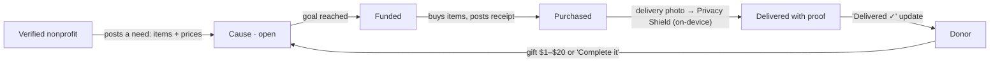

**Show the situation, never expose the person.** Cover photos show where the need is — a night street, a bus stop, a shelter dormitory, a street dog — with people only from behind, far away or as hands, so no one being helped can be identified. They’re labelled “Illustrative photo”; causes without one get an illustration built from their budget.

## Screenshots

| Causes | Cause | What it pays for | Give |
|---|---|---|---|
| 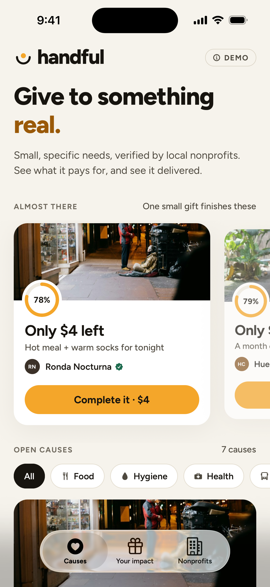 | 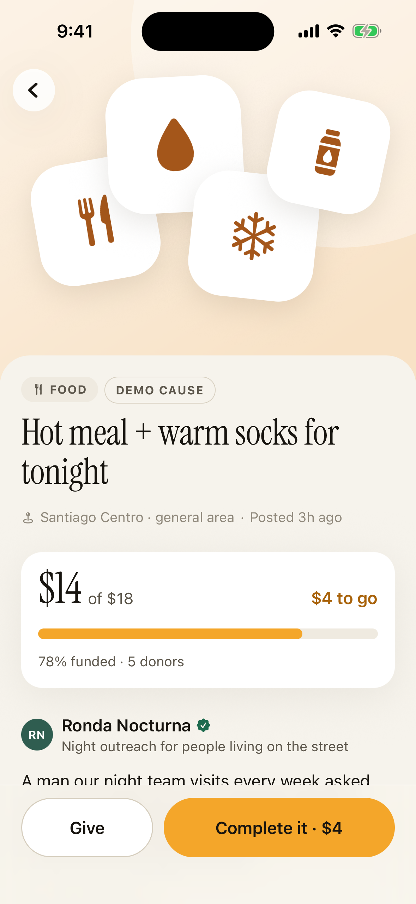 | 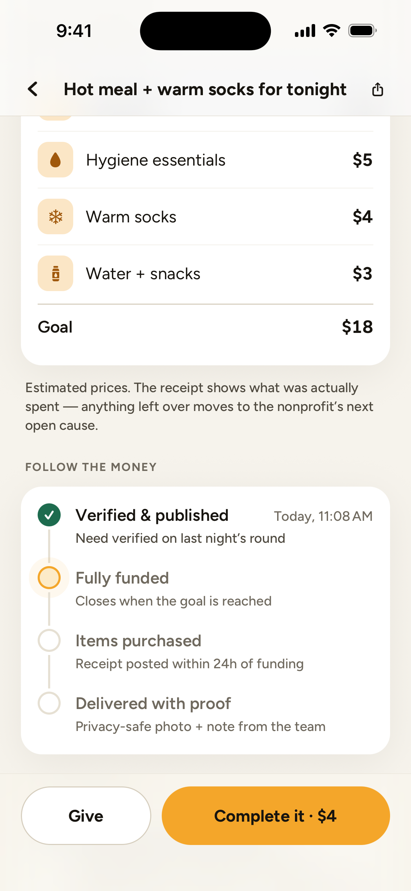 | 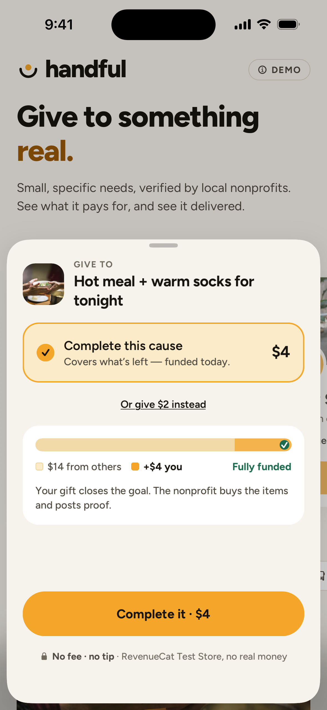 |

| Privacy Shield: found | Privacy Shield: protected | Post a cause (1 of 3) | Review & publish |
|---|---|---|---|
| 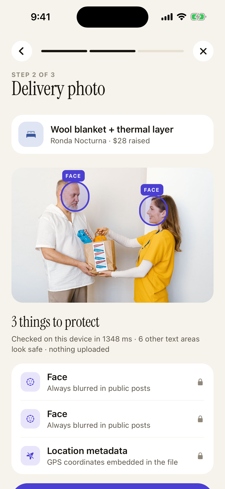 | 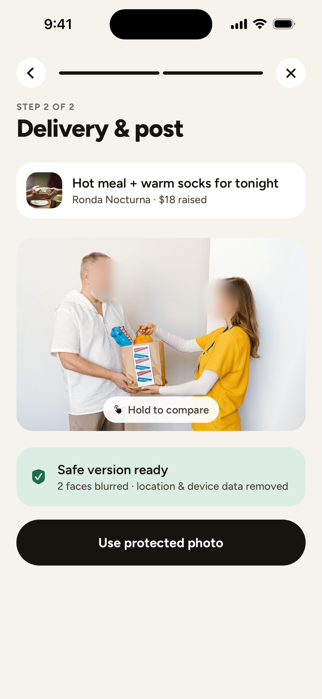 | 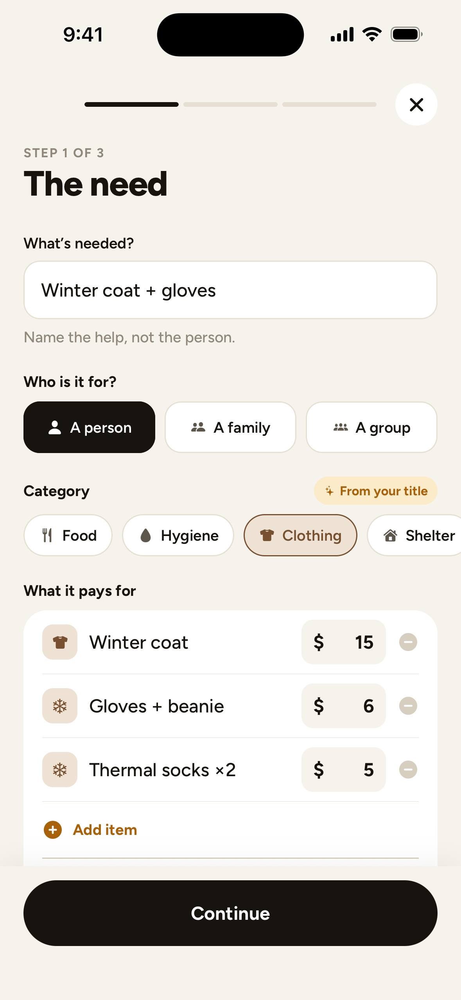 | 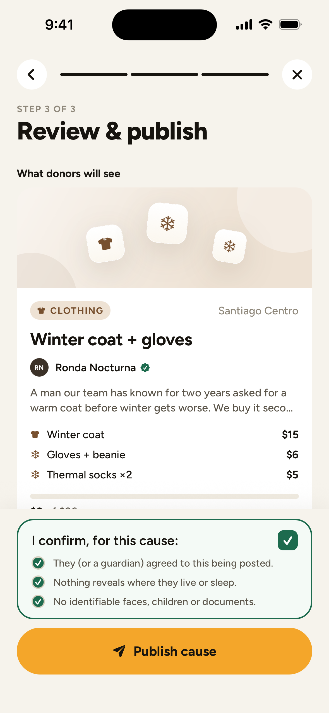 |

| Post proof | Delivered, with proof | Donor notification | Protected tent photo |
|---|---|---|---|
| 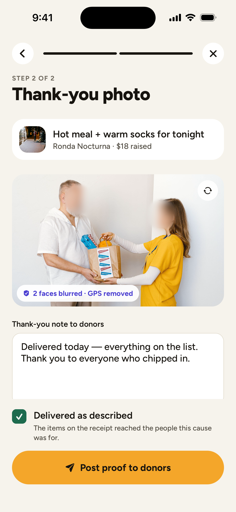 | 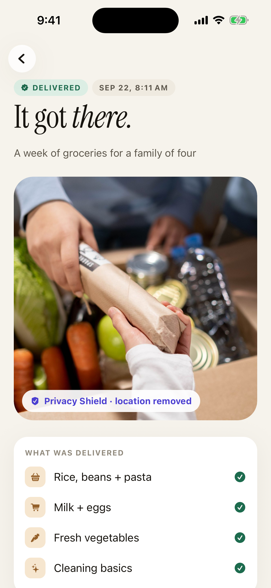 | 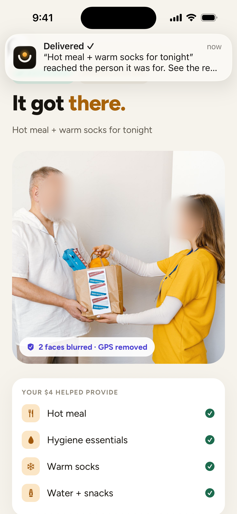 | 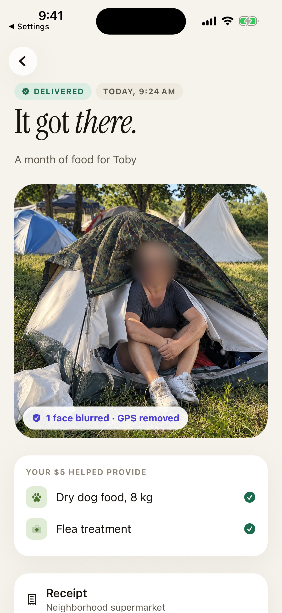 |

| Nonprofit funds | Manage a cause | Withdraw (simulated) | Thank-you in Your impact |
|---|---|---|---|
| 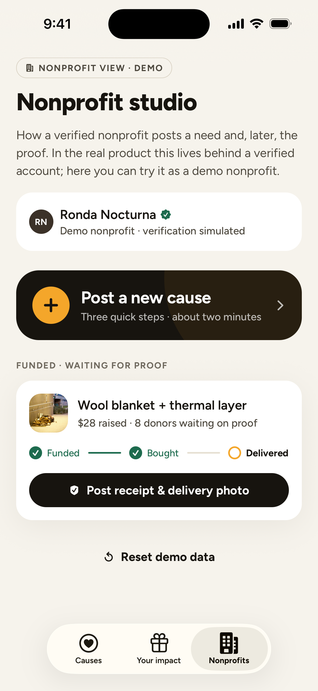 | 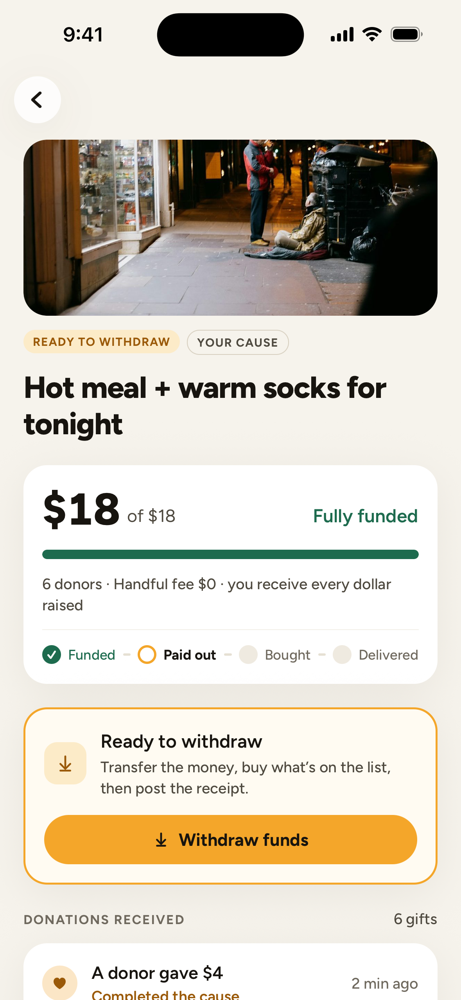 | 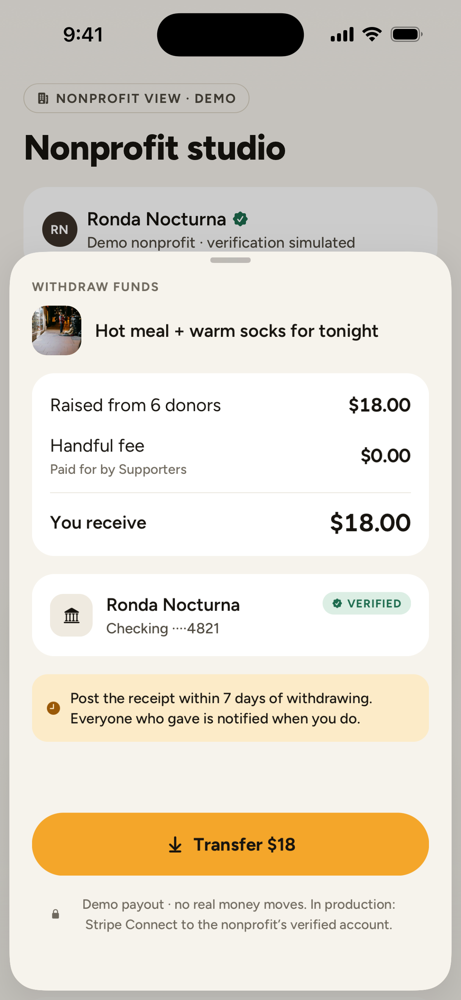 | 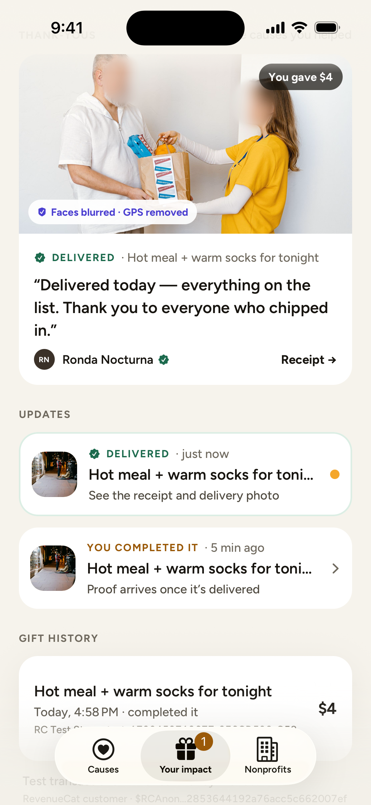 |

| It got there (home) | Who else gave (anonymous) | Your impact | Supporter |
|---|---|---|---|
| 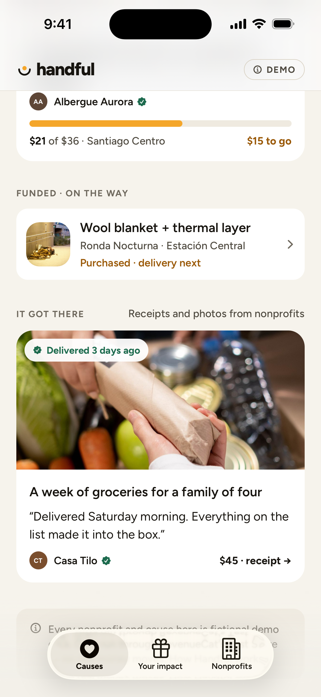 | 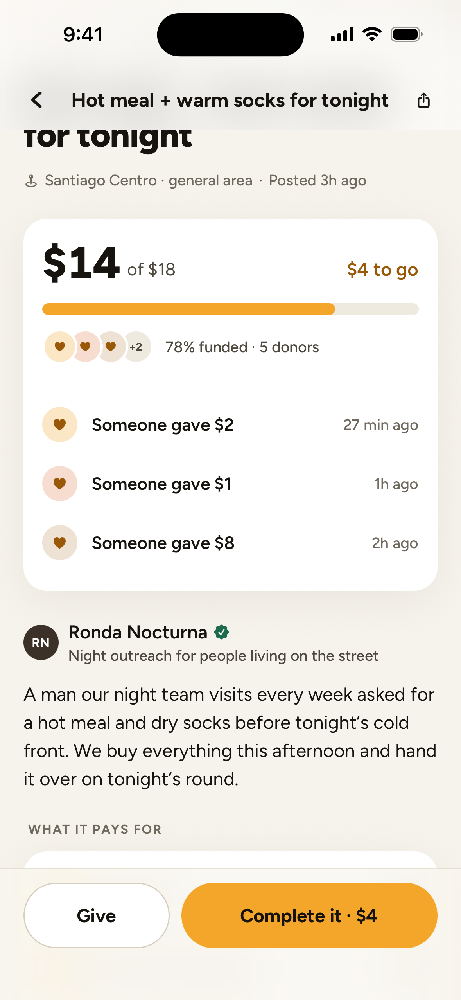 | 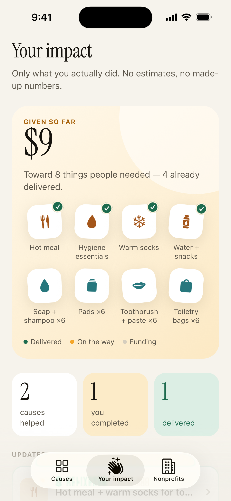 | 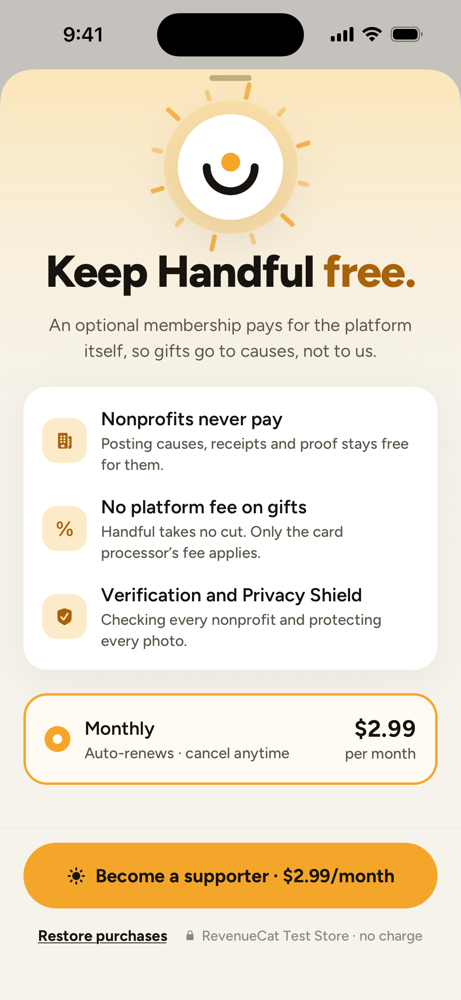 |

## What we learned from existing giving apps

Before the last design pass we looked at how GoFundMe, DonorsChoose, charity: water, ShareTheMeal and Kiva handle the same moments. Handful keeps their evidence-backed patterns — progress with visible recent gifts, a share prompt right after giving, a line-item budget, a delivery update — and drops the ones that cost dignity or trust: photos of people in need, countdowns, named donor leaderboards, preselected tips. Details and sources: [docs/MARKET.md](docs/MARKET.md).

## How RevenueCat is used

There are two RevenueCat flows in the app, and we want to be precise about what each one is.

**1. Gifts (prototype only) — RevenueCat Test Store consumables.**
Each gift is a purchase of a consumable product `handful_gift_<amount>` (`$1` … `$20`). The app calls `Purchases.getProducts()` and `Purchases.purchaseStoreProduct()`; the Test Store presents its purchase sheet; the resulting `transactionIdentifier` is stored with the gift and shown in the Impact screen’s gift history. Whole-dollar tiers are why “Complete it” always matches the exact remainder.

This is real SDK integration — but **it is not how donations should work in production**, and we don’t pretend otherwise: App Store Review Guideline 3.2.2(iv) doesn’t allow collecting charitable donations with in-app purchase. See [Production architecture](#production-architecture).

**2. Handful Supporter (production-ready model) — subscription + entitlement.**
An optional monthly membership that pays for the platform itself, so nonprofits pay nothing and gifts carry no platform fee. It uses an offering (`supporter`), a monthly package, and an entitlement (`supporter`) checked through `CustomerInfo` and a `CustomerInfo` update listener. The paywall reads its price from the offering’s package, and **Restore purchases** calls `Purchases.restorePurchases()` (App Review requires a restore path for subscriptions). Guideline 3.1.1 allows in-app purchase for supporting the developer, so this is the part of the stack RevenueCat keeps powering after launch.

Code: [`src/lib/purchases.ts`](src/lib/purchases.ts), [`src/app/give/[id].tsx`](src/app/give/[id].tsx), [`src/app/supporter.tsx`](src/app/supporter.tsx).

## Privacy Shield

A local Expo native module in Swift: [`modules/privacy-shield`](modules/privacy-shield/ios/PrivacyShieldModule.swift). It runs entirely on the device with Apple’s **Vision** and **Core Image** frameworks — the original photo is never uploaded.

- **Detects** faces (`VNDetectFaceRectanglesRequest`), text (`VNRecognizeTextRequest`) and documents (`VNDetectDocumentSegmentationRequest`), and reads GPS / device metadata (ImageIO).
- **Classifies** recognized text in JS ([`src/lib/privacy.ts`](src/lib/privacy.ts)): license plates, ID numbers (incl. Chilean RUT), addresses, phone numbers, emails. Documents with several lines of text are hidden whole.
- **Redacts** with a mosaic + heavy blur and a feathered mask, then re-encodes a fresh JPEG with **no GPS, camera or capture metadata** (only basic image properties remain).
- **Faces are always blurred** in public posts. It isn’t a setting — we don’t think a checkbox can prove consent.
- The nonprofit sees what was found, can hold to compare with the original, and only the protected version is attached.

The same idea applies to words: a **story check** flags exact addresses, where someone sleeps, phone and ID numbers, health conditions, children’s exact ages and full names before a cause can be published.

## Architecture

```
src/
  app/                    Expo Router screens
    (tabs)/index.tsx      Causes (home)
    (tabs)/impact.tsx     Your impact + updates + gift history
    (tabs)/studio.tsx     Nonprofit studio (demo)
    cause/[id].tsx        Cause detail: budget, timeline, trust & privacy
    give/[id].tsx         Gift sheet → RevenueCat
    success/[id].tsx      Ring-closing success
    proof/[id].tsx        Delivery proof (donor view)
    nonprofit/new.tsx     Post a cause: need & budget → story & photo → review (one confirmation)
    nonprofit/proof/[id]  Post proof: receipt → thank-you photo + note
    nonprofit/cause/[id]  Manage a cause: money received, donations, stage, next step
    nonprofit/withdraw/[id] Withdraw a funded cause's money (simulated payout)
    supporter.tsx         Supporter membership (RevenueCat subscription)
  components/             Design system: Txt, Button, Pill, Ring, CoverArt, Timeline, ShieldReview…
  data/                   Types, categories, demo seed data
  lib/                    purchases (RevenueCat), privacy (Shield logic), funds (payout stages, where your money is), guess, notifications, format
  store/useStore.ts       Zustand + AsyncStorage (all state is local)
  theme/tokens.ts         Color, type, spacing, radius, motion
modules/privacy-shield/   Local Expo module (Swift, Vision, Core Image)
```

No backend, no login. State lives on the device. The “nonprofit” and the “donor” are the same phone in this demo; a delivered update fires a local notification to stand in for a push.

**Stack:** Expo SDK 57, React Native 0.86 (New Architecture), Expo Router (native tabs), TypeScript, Reanimated 4, react-native-svg, expo-symbols (SF Symbols), expo-haptics, expo-image-picker, expo-notifications, Zustand, react-native-purchases 10, Figtree.

## Run it

**Requirements:** macOS with Xcode 26+, an iOS Simulator runtime, Node 20+, CocoaPods. No paid Apple developer account is needed.

```bash
git clone https://github.com/zhbozzo/handful.git
cd handful
npm install
cp .env.example .env        # then add your RevenueCat Test Store key (see below)
npx expo run:ios            # builds the dev client and opens the iOS Simulator
```

If port 8081 is busy: `npx expo run:ios --port 8090`.

> **Use a debug build.** RevenueCat’s SDK refuses Test Store keys in release builds on purpose (“Wrong API Key… the app will close”), so gifts through the Test Store only work in debug/dev-client builds. That’s also how the demo video was recorded.

Without a RevenueCat key the app still runs: gifts are recorded as **“offline demo”** (clearly labeled, no SDK call), and the Supporter screen explains how to enable it.

### Environment variables

| Variable | Notes |
|---|---|
| `EXPO_PUBLIC_REVENUECAT_API_KEY` | RevenueCat **Test Store** public SDK key (`test_…`). The only variable the app reads. |

### RevenueCat setup

1. Create a project in the [RevenueCat dashboard](https://app.revenuecat.com).
2. **Apps & providers → Test configuration** → create the Test Store and copy its API key into `.env`.
3. In **Product catalog**, create (Test Store app):
   - 20 **consumable** products `handful_gift_1` … `handful_gift_20`, priced $1 … $20.
   - 1 **subscription** `handful_supporter_monthly` ($2.99 / month).
   - Entitlement `supporter` → attach `handful_supporter_monthly`.
   - Offering `supporter` with a `$rc_monthly` package → attach `handful_supporter_monthly`.
4. Restart Metro (`npx expo start --dev-client`) so the key is picked up.

## Tests & checks

```bash
npm test            # Jest: Privacy Shield rules (plates, IDs, addresses, story check) and the gift/proof state machine
npm run typecheck   # TypeScript, strict
npx eslint .        # Expo config incl. React Compiler rules
```

CI runs all three on every push (`.github/workflows/ci.yml`).

### QA helpers (debug builds only)

Launch arguments drive the debug build without taps, for screenshots and QA — they are compiled out of release builds (`__DEV__`):

```bash
xcrun simctl launch --terminate-running-process booted app.handful.demo -handfulDev reset
xcrun simctl launch --terminate-running-process booted app.handful.demo -handfulDev "go:/cause/hot-meal-tonight"
xcrun simctl launch --terminate-running-process booted app.handful.demo -handfulDev "shield:1500"   # Privacy Shield on a bundled photo
xcrun simctl launch --terminate-running-process booted app.handful.demo -handfulDev rc              # log RevenueCat products/offerings
```

## Demo data

- Nine demo causes from six fictional nonprofits in Santiago and Valparaíso, Chile ([`src/data/seed.ts`](src/data/seed.ts)). Names are invented; any resemblance to a real organization is unintended.
- Beneficiaries are never named; one cause names a dog (Toby). Locations are neighborhoods, never addresses.
- Demo photos: two Pexels photos (Pexels License) and one **AI-generated** image (`assets/demo/tent-ai-generated.jpg`, not a real person) used only to show Privacy Shield working. GPS tags on demo photos were added on purpose so the metadata stripping can be seen.
- Verification checks, consent and receipts are simulated and labeled as such in the UI.
- **Your impact starts at zero.** It only reflects gifts you make in the app — no seeded “impact”.
- **Nonprofit studio → Reset demo data** restores the starting state.

## Limitations

- Single device, local state: the nonprofit and donor views share one phone.
- iOS only. Privacy Shield uses Apple Vision; an Android version would use ML Kit.
- Text classification is heuristic (regex over recognized text). It catches common plates, IDs, addresses and phones, not everything.
- Face detection can miss faces that are very small, turned away or heavily occluded. Faces turned away are, by design, fine to show.
- The scene check (warns when a photo seems to show where someone sleeps, e.g. a tent) uses `VNClassifyImageRequest`. In the iOS Simulator that request returns no usable labels, so this advisory is only unit-tested, not verified end to end; it needs a real device.
- Receipts are typed line items; production would require a receipt photo and review.

## Production architecture

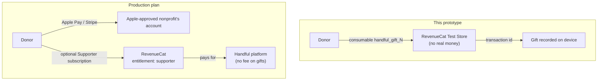


What would change before real money moves:

- **Payments:** gifts processed with **Apple Pay** (and Stripe for web/Android), paid out to the **nonprofit’s** account via Stripe Connect or a nonprofit donation provider — never to individuals. Every nonprofit listed would go through Apple’s nonprofit approval (Guideline 3.2.1(vi)) and issue tax receipts where required.
- **RevenueCat:** keeps powering the Supporter subscription and entitlements; gift transactions could be mirrored into RevenueCat customer history for a single donor record.
- **Trust:** nonprofit verification (registry, bank account ownership, field visit), receipt review, payout holds until proof, fraud and anomaly checks, leftover-funds policy.
- **Privacy & legal:** written consent flows, a specific policy for minors (no identifiable children, ever), data-retention rules, local regulation review (e.g. Chile’s Ley 19.628 as amended by Ley 21.719, GDPR where applicable). **This prototype does not claim a complete legal framework.**
- **Server-side Privacy Shield** as a second check before publishing, with human review for flagged posts.

## Safety & privacy philosophy

- Show the help, not the suffering.
- Money goes to verified nonprofits, never to anonymous individuals.
- No exact locations, no full names, no diagnoses, no identifiable children.
- Proof protects dignity first; transparency never depends on exposing someone.
- Nothing in the app implies money moved when it didn’t.

### Photo credits

Illustrative cause photos from [Unsplash](https://unsplash.com/license) (free to use under the Unsplash License), cropped and stripped of metadata:
[Sinitta Leunen](https://unsplash.com/photos/2h0Vt8l-_GQ) (night street) ·
[Anthony Young](https://unsplash.com/photos/pCJCfl5HWdA) (Toby) ·
[the blowup](https://unsplash.com/photos/IQj77ckUsbM) (bus stop) ·
[Towfiqu barbhuiya](https://unsplash.com/photos/Yw9Vgr6i_-0) (medication) ·
[Sonu Agvan](https://unsplash.com/photos/_Xlcw84K7Tg) (walk to school) ·
[ran liwen](https://unsplash.com/photos/3BzWXnG3Dvc) (mother and son) ·
[Sergio Aguirre](https://unsplash.com/photos/z8EYXn0OAYM) (smoke-stained kitchen) ·
[Mihály Köles](https://unsplash.com/photos/324p_yfAZhE) (blankets on the street) ·
[Adem Percem](https://unsplash.com/photos/ypE9DgHdEYo) (shelter dormitory).
Delivery-proof demo photos: Pexels and one AI-generated image (the tent), both processed by Privacy Shield in the app.

## License

[MIT](LICENSE). Font: Figtree (SIL Open Font License). Icons: SF Symbols (Apple, used on Apple platforms under Apple’s license).
